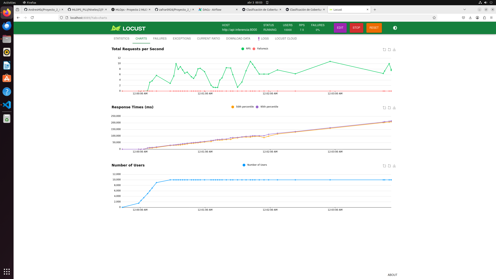

# Proyecto MLOps - Clasificación de Cobertura Forestal 🌲

Este proyecto implementa un flujo completo de MLOps utilizando **Airflow**, **MLflow**, **MinIO**, y un servicio de inferencia con **FastAPI**, para entrenar y servir un modelo de clasificación de cobertura forestal.

---

## 🗂 Estructura del Proyecto
```
Proyecto_2_MLOPS/
├── airflow/                    # Configuración de Airflow
│   ├── dags/                  # DAGs de Airflow
│   ├── logs/                  # Logs generados por tareas
│   └── plugins/               # Plugins personalizados
├── datos_raw/                 # Archivos JSON de entrada
├── inference_api/            # (opcional si se mueve el main.py aquí)
├── mlflow/                    # Artefactos registrados en MLflow
├── modelos/                   # Modelos entrenados (ej. modelo_rf.pkl)
│   └── modelo_rf.pkl
├── app_inferencia.py          # API de inferencia con FastAPI
├── app_streamlit.py           # Interfaz de usuario con Streamlit
├── Dockerfile                 # Dockerfile de la API de inferencia
├── Dockerfile.locust          # Dockerfile para pruebas de carga con Locust
├── Dockerfile.streamlit       # Dockerfile de la app Streamlit
├── docker-compose.yml         # Compose general del proyecto
├── docker-compose.api.yaml    # Compose para levantar solo la API desde imagen
├── docker-compose.locust.yml  # Compose para Locust + API local
├── docker-compose.locust.remote.yml  # Compose para Locust + API remota (DockerHub)
├── locustfile.py              # Script de prueba de carga con Locust
├── requirements.txt           # Requisitos para la API FastAPI
├── requirements-locust.txt    # Requisitos para Locust
└── README.md                  # Documentación general del proyecto
```

---

## ⚙️ Servicios que se levantan

Con `docker-compose up -d` se crean los siguientes servicios:

- **Airflow (webserver, scheduler, worker)**
- **MLflow + MySQL (backend store)**
- **MinIO (artifact store para MLflow)**
- **FastAPI (API para inferencia del modelo)**
- **Streamlit (Interfaz para API )**

---

## 🧬 Flujo de trabajo

### 1. 🧪 Preparar los datos

Guardar archivos `.json` en la carpeta `datos_raw/`. Cada archivo debe tener una estructura similar:
```json
{
  "data": [
    {
      "Elevation": 2800,
      "Aspect": 45,
      "Slope": 10,
      ...,
      "Wilderness_Area": 2,
      "Soil_Type": 3,
      "Cover_Type": 1
    },
    ...
  ]
}
```

### 2. ⚙️ Entrenar el modelo con Airflow

- DAG: `entrenar_modelo`
- Ejecuta `PythonOperator` que:
  - Lee todos los archivos JSON
  - Hace one-hot encoding de `Wilderness_Area` y `Soil_Type`
  - Entrena un `RandomForestClassifier`
  - Loguea el modelo en MLflow
  - Guarda el modelo como `modelos/modelo_rf.pkl`

✅ El modelo resultante espera **features one-hot encoded**.

### 3. 🔮 Servir el modelo con FastAPI

#### app_inferencia.py
- Carga el modelo `modelos/modelo_rf.pkl`
- Preprocesa la entrada haciendo one-hot encoding **dinámico**
- Rellena con ceros las columnas faltantes
- Devuelve la predicción

#### Ejemplo de request:
```bash
curl -X POST http://localhost:8000/predecir   -H "Content-Type: application/json"   -d '{ "Elevation": 3000, "Aspect": 45, "Slope": 10, "Horizontal_Distance_To_Hydrology": 100, "Vertical_Distance_To_Hydrology": 50, "Horizontal_Distance_To_Roadways": 200, "Hillshade_9am": 200, "Hillshade_Noon": 220, "Hillshade_3pm": 180, "Horizontal_Distance_To_Fire_Points": 150, "Wilderness_Area": 1, "Soil_Type": 2 }'
```

Respuesta esperada:
```json
{ "cover_type_predicho": 1 }
```

### 4. 🐍 Pruebas de carga con Locust

Se desarrolló una prueba de estrés utilizando Locust. Existen dos archivos:

- `docker-compose.locust.yml`: usa la API local.
- `docker-compose.locust.remote.yml`: usa la imagen en DockerHub (`zafrar09/app-inferencia:latest`).

Para levantar la UI de pruebas:
```bash
sudo docker compose -f docker-compose.locust.remote.yml up --build
```

Accede a Locust desde [http://localhost:8089](http://localhost:8089), define el número de usuarios concurrentes y velocidad de entrada.

---

## 🧰 Comandos útiles

- **Levantar todos los servicios (proyecto completo)**:
  ```bash
  sudo docker compose up --build -d
  ```

- **Ver logs del API de inferencia**:
  ```bash
  sudo docker logs -f api-inferencia
  ```

- **Reconstruir solo la API**:
  ```bash
  sudo docker compose up --build -d api-inferencia
  ```

- **Ejecutar Locust**:
  ```bash
  sudo docker compose -f docker-compose.locust.remote.yml up --build
  ```

---
-- **Monitoreo Locust**:
El contenedor no es capaz de manejar 10.000 usuarios agregando 500 cada vez con la configuracion inicial de:

      replicas: 1
      resources:
        limits:
          cpus: "0.25"
          memory: "128M"

La minima configuracion que fue efectiva es:
      replicas: 3
      resources:
        limits:
          cpus: "0.2"
          memory: "512M"

Se ve asi:



## 🛠️ Solución de problemas

### ❗ Error de permisos en logs de Airflow

Si ves errores tipo "Operation not permitted":
```bash
mkdir -p ./airflow/logs
chmod -R 777 ./airflow/logs
```
Esto otorga permisos de escritura al contenedor sobre la carpeta de logs.

---

## ✅ Checklist final

- [x] Datos preparados en `datos_raw/`
- [x] DAG `entrenar_modelo` ejecutado con éxito
- [x] Modelo almacenado localmente y en MLflow
- [x] Imagen de inferencia publicada en DockerHub (`zafrar09/app-inferencia`)
- [x] API FastAPI sirviendo correctamente
- [x] Pruebas de carga realizadas con Locust
- [x] Streamlit funcionando como interfaz

---

Hecho por Edwin A. Caro, Andres F. Matallana, Santiago Zafra R.

